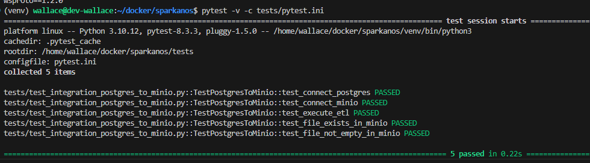

# TestPostgresToMinio - Integration Test Documentation

## Overview
The `TestPostgresToMinio` class is designed to validate the integration between a PostgreSQL database and a MinIO object storage system. This integration test suite ensures that the ETL (Extract, Transform, Load) process operates correctly by verifying the connection to both systems and checking the integrity of the data transfer.

## Requirements
- Python 3.x
- Libraries:
  - `pytest`
  - `psycopg2`
  - `minio`
  - `polars`
  - `python-dotenv`
- PostgreSQL database
- MinIO

## Test Structure
The class contains the following test methods:

### 1. `configure_args()`
Returns configuration arguments, including the filename that will be generated.

### 2. `test_connect_postgres()`
Tests the connection to the PostgreSQL database. Ensures that the connection is successfully established.

### 3. `test_connect_minio()`
Tests the connection to the MinIO client. Verifies if the connection is successful.

### 4. `test_execute_etl()`
Executes the ETL process:
- Extracts data from the `tb_integration_test` table in PostgreSQL.
- Converts the extracted data into CSV format.
- Loads the resulting CSV file into MinIO.

### 5. `test_file_exists_in_minio()`
Checks if the file generated by the ETL process exists in MinIO.

### 6. `test_file_not_empty_in_minio()`
Confirms that the file generated in MinIO is not empty.

## Auxiliary Methods
The class also includes auxiliary methods to create connections and verify the existence and content of the file:

- `create_connection()`: Creates and returns a connection to the PostgreSQL database.
- `connect_minio()`: Establishes and returns a connection to the MinIO client.
- `file_exists_in_minio(client, filename)`: Checks if the specified file exists in MinIO.
- `file_not_empty_in_minio(client, filename)`: Checks if the specified file in MinIO is not empty.


## How to Run the Tests
To execute the integration tests, follow these steps:

1 - Enable the virtual environment

```
source venv/bin/activate
```

2 - Run command
```
pytest -v -c tests/pytest.ini
```

expected result:

